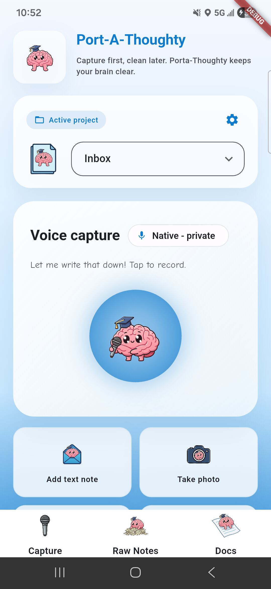
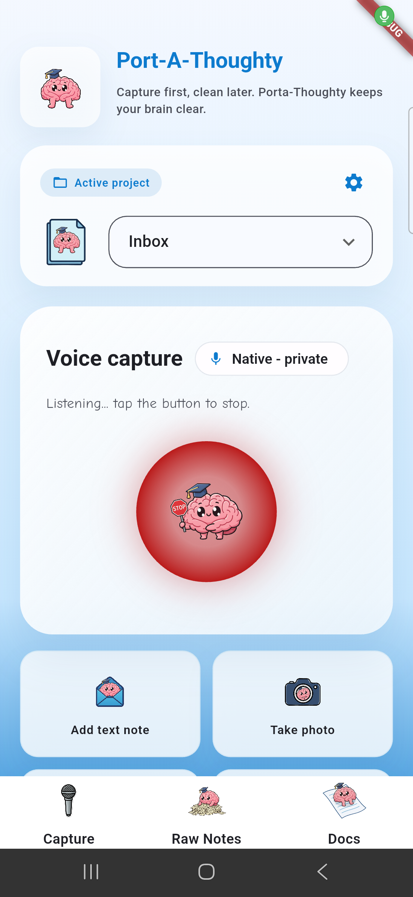
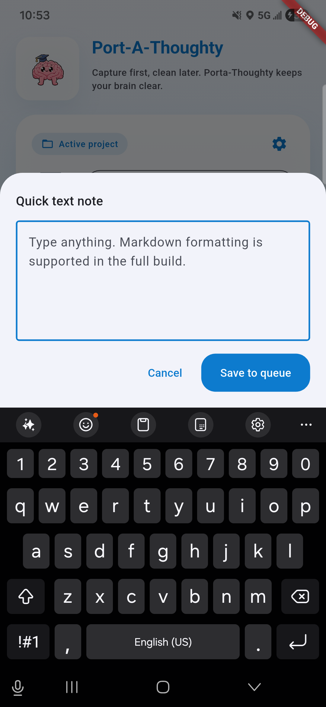
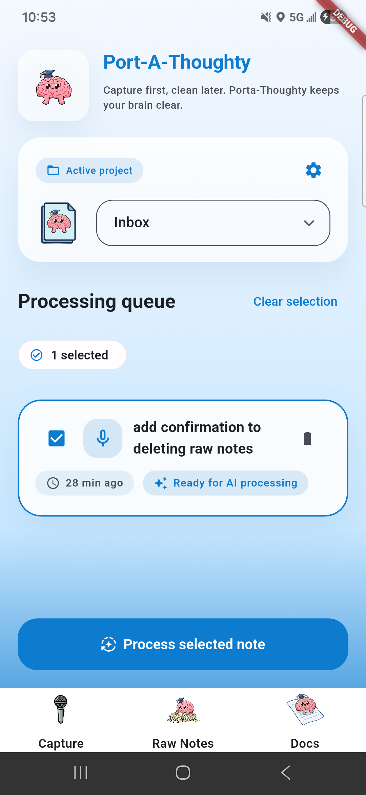

# Port-A-Thoughty 🧠

> Capture first, clean later. Port-A-Thoughty keeps your brain clear.

A Flutter mobile app for capturing fleeting thoughts through voice, text, and images, then organizing them into structured Markdown documents with AI assistance.

## ✨ Features

### 🎤 Multi-Modal Capture
- **Voice Recording**: Native speech-to-text with privacy-first offline processing
  - Two recording modes: Press & Hold OR Tap to Start/Stop
  - Configurable silence timeout (default 8 seconds)
  - Low confidence flagging with visual warnings
  - Haptic feedback and animated recording indicator
- **Text Notes**: Quick text input via modal bottom sheet
- **Image OCR**: Capture photos with automatic text extraction using Google ML Kit
  - Include/exclude image toggle in final document
  - Image preview before saving
- **File Upload**: Process documents with AI-powered content extraction
  - Supports images (jpg, png, gif, webp) and text files (txt, md)
  - Groq AI vision model for intelligent content extraction

### 📋 Smart Organization
- **Project-Based**: Organize notes into custom projects with types:
  - Grocery List (with checkbox format and category grouping)
  - Dev Project (bugs, features, ideas categorization)
  - Creative Writing (theme/character/plot organization)
  - General Todo (priority and task organization)
- **Queue System**: All captures land in a processing queue for later review
  - Multi-select with checkboxes
  - Swipe-to-delete with undo functionality
  - Pull-to-refresh
  - Note editing (tap to edit transcriptions, OCR text, or content)
- **Batch Processing**: Select multiple notes to process together into cohesive documents

### 🤖 AI-Powered Processing
- **Multiple AI Provider Support**:
  - Groq (primary - llama-3.3-70b-versatile)
  - OpenAI, Gemini, Anthropic (configurable in settings)
- **Automatic Summarization**: Convert raw notes into organized bullet points
- **Custom Prompts**: Each project type has tailored AI processing instructions
- **Markdown Export**: All processed documents saved as shareable Markdown files
- **Undo Functionality**: Revert document processing within 7 days

### 🔗 Platform Integrations
- **Share Intent Handling**: Receive text and images from other apps
  - Auto-OCR on shared images
  - Automatic addition to queue
- **Home Widget**: Quick recording from Android home screen widget
  - Deep link support for instant capture
- **Native Sharing**: Share processed documents to any app

### ⚙️ Comprehensive Settings
- **API Key Management**: Secure storage for 4 AI providers (OpenAI, Gemini, Anthropic, Groq)
  - Obscured password fields with show/hide toggle
  - Paste from clipboard functionality
- **Voice Recording Settings**:
  - Configurable silence timeout
  - Press & hold recording mode toggle
- **Version Display**: Track app version (currently 1.0.0)

### 🎨 Beautiful UI
- Fixed header design with smooth scrolling and gradient fade
- Material Design 3 theming with custom color scheme
- Custom illustrations and 20+ handcrafted icons
- Professional bottom sheets and modals with shadows
- Haptic feedback throughout (light/medium/heavy impacts)
- Smooth animations and transitions (300ms Material motion curves)

## 📱 Screenshots

<table>
  <tr>
    <td></td>
    <td></td>
    <td></td>
  </tr>
  <tr>
    <td align="center"><b>Capture Screen</b><br/>Voice recording (idle)</td>
    <td align="center"><b>Recording</b><br/>Active voice capture</td>
    <td align="center"><b>Text Input</b><br/>Quick note composer</td>
  </tr>
</table>

<table>
  <tr>
    <td></td>
  </tr>
  <tr>
    <td align="center"><b>Queue Screen</b><br/>Batch processing notes</td>
  </tr>
</table>

## 🏗️ Architecture

### State Management
- **Provider**: Single `PortaThoughtyState` class (lib/state/app_state.dart) manages the entire app
- Reactive updates across all screens
- Centralized coordination between services
- Manages project selection, note capture, queue, document generation, and settings

### Database
- **SQLite**: Cross-platform persistence with `sqflite` (Android/iOS) and `sqflite_common_ffi` (Windows/Linux/macOS)
- Schema version: **2** with migration support
- Four main tables:
  - `projects`: User-defined collections with types and custom prompts
  - `notes`: Individual captured thoughts (soft-deletable with deleted_at)
  - `docs`: Generated Markdown documents with metadata
  - `settings`: Key-value store for user preferences and API keys
- Secure storage for API keys

### Core Services
- **NativeSpeechToTextService** (lib/services/native_speech_to_text.dart):
  - Wraps speech_to_text plugin for cross-platform voice capture
  - Confidence scoring and callback-based result handling
- **OcrService** (lib/services/ocr_service.dart):
  - Google ML Kit text recognition
  - Confidence tracking for extracted text
- **DocGenerator** (lib/services/doc_generator.dart):
  - Markdown file generation with Groq AI integration
  - Project-based file organization in app support directory
  - Includes AI summary and raw notes sections
- **GroqService** (lib/services/groq_service.dart):
  - Chat completions API for note summarization
  - Uses llama-3.3-70b-versatile model
  - Custom system prompts per project type
- **GroqFileProcessor** (lib/services/groq_file_processor.dart):
  - AI-powered file content extraction
  - Uses llama-3.2-90b-vision-preview for images
  - Base64 encoding for image processing

### Navigation
- **PageView** with PageController for smooth screen transitions
- Bottom navigation bar with three main screens:
  1. Queue Screen ("Raw Notes") - Unprocessed notes
  2. Capture Screen (default) - Primary input interface
  3. Docs Screen - Archive of processed documents
- Fixed header component stays at top while content scrolls
- Additional screens: Settings (modal route)
- 300ms Material motion curve transitions

## 🚀 Getting Started

### Prerequisites
- Flutter SDK (latest stable)
- Android SDK / Xcode (for mobile development)
- Git

### Installation

1. **Clone the repository**
   ```bash
   git clone https://github.com/TrustEden/port-a-thoughty.git
   cd port-a-thoughty
   ```

2. **Install dependencies**
   ```bash
   flutter pub get
   ```

3. **Run the app**
   ```bash
   flutter run
   ```

4. **Configure API Keys** (First time setup):
   - Launch the app
   - Tap the settings icon (gear) in the header
   - Enter your Groq API key (get one from [console.groq.com](https://console.groq.com))
   - Optionally configure OpenAI, Gemini, or Anthropic keys for future features

### Platform-Specific Setup

#### Android
- Minimum SDK: 21
- Target SDK: 34
- Permissions required: Microphone, Camera, Storage

#### Windows/Linux/macOS
- Uses `sqflite_common_ffi` for desktop database support
- Speech recognition may have limited support on desktop

## 🛠️ Development

### Project Structure
```
lib/
├── main.dart                      # App entry point, navigation, share intents, widget integration
├── models/                        # Data models
│   ├── note.dart                  # Note with type (voice/text/image/file)
│   ├── project.dart               # Project with type and custom prompts
│   ├── processed_doc.dart         # Document metadata
│   └── user_settings.dart         # User preferences
├── screens/                       # Main screens
│   ├── capture_screen.dart        # Voice, text, image, file capture UI
│   ├── queue_screen.dart          # Multi-select queue with editing
│   ├── docs_screen.dart           # Document archive with sharing
│   └── settings_screen.dart       # API keys, voice settings, about
├── services/                      # Business logic
│   ├── local_database.dart        # SQLite with 4 tables (projects, notes, docs, settings)
│   ├── native_speech_to_text.dart # Voice capture with confidence scoring
│   ├── ocr_service.dart           # Google ML Kit text recognition
│   ├── doc_generator.dart         # Markdown generation with AI
│   ├── groq_service.dart          # AI summarization service
│   └── groq_file_processor.dart   # AI file content extraction
├── state/                         # State management
│   └── app_state.dart             # Central Provider state class
├── theme/                         # App theming
│   └── app_theme.dart             # Material Design 3 custom theme
└── widgets/                       # Reusable components
    ├── app_header.dart            # Fixed header with gradient
    └── project_selector.dart      # Project dropdown and management
```

### Key Commands
```bash
# Run on specific device
flutter devices
flutter run -d <device-id>

# Hot reload
r  (in running app terminal)

# Build for production
flutter build apk          # Android
flutter build windows      # Windows
flutter build ios          # iOS

# Code analysis
flutter analyze

# Format code
dart format .
```

## 📝 Usage Workflow

1. **First Time Setup**:
   - Open Settings (gear icon in header)
   - Add your Groq API key (or other AI provider keys)
   - Configure voice recording preferences (silence timeout, press & hold mode)

2. **Capture Thoughts**: Use voice, text, image, or file upload to quickly capture ideas
   - Voice: Tap and hold (or tap once) the microphone button
   - Text: Tap the text icon for quick note entry
   - Image: Tap camera icon to capture photo with OCR
   - File: Tap upload icon to process documents with AI

3. **Organize with Projects**:
   - Select active project from dropdown (Inbox, Dev Project, etc.)
   - Create new projects with custom types and AI prompts
   - Each note is automatically tagged with the active project

4. **Review & Edit Queue**:
   - Navigate to "Raw Notes" to see all unprocessed captures
   - Tap any note to edit transcription, OCR text, or content
   - Swipe to delete unwanted notes (with undo)
   - Edit low-confidence voice transcriptions

5. **Select & Process**:
   - Use checkboxes to select multiple notes
   - Tap "Process Selected" and give your document a title
   - AI will organize notes into a structured Markdown summary
   - Option to undo processing within 7 days

6. **Review & Share Docs**:
   - Check the "Docs" tab for your organized Markdown summaries
   - Tap to preview full document
   - Share to any app using the share button
   - Delete processed documents as needed

7. **Quick Capture from Anywhere** (Android):
   - Add home screen widget for instant recording
   - Share text/images from other apps directly to Port-A-Thoughty

## 🔧 Configuration

### API Keys Setup
Configure AI providers in Settings screen:

1. **Groq** (Primary - Required):
   - Get API key from [console.groq.com](https://console.groq.com)
   - Used for: Note summarization and file processing
   - Models: llama-3.3-70b-versatile, llama-3.2-90b-vision-preview

2. **OpenAI, Gemini, Anthropic** (Optional):
   - Additional provider support (configurable in settings)
   - Not currently used but available for future features

All API keys are stored securely in the local SQLite database.

### Voice Recording Settings
- **Silence Timeout**: Configure how long to wait for speech before auto-stopping (default: 8 seconds)
- **Press & Hold Mode**: Toggle between "press and hold" vs "tap to start/stop" recording modes

### Adding New Projects
Projects are created via the "New project" button with:
- **Name**: 4-20 characters
- **Type**: Grocery List, Dev Project, Creative Writing, or General Todo
- **Description**: Optional AI processing instructions (required for Dev/Creative projects, max 400 chars)
- Each project type has tailored AI prompt templates:
  - **Grocery List**: Checkbox format with category grouping
  - **Dev Project**: Categorizes as bugs, features, ideas, or questions
  - **Creative Writing**: Organizes by theme, character, and plot elements
  - **General Todo**: Task organization with priority levels

### Platform-Specific Features

#### Android Home Widget
Add the Port-A-Thoughty widget to your home screen for instant voice recording:
- Long press home screen → Widgets → Port-A-Thoughty
- Tap widget to instantly start recording
- Deep links directly to capture screen

#### Share Intents (Android/iOS)
Share content from other apps:
- Text: Automatically added to queue
- Images: Auto-OCR extraction and added to queue
- Confirmation toast after successful capture

### Database Migrations
Current schema version: **2**

Schema includes four tables:
- `projects` (id, name, type, description, icon, color, created_at)
- `notes` (id, project_id, type, content, image_path, include_image, low_confidence, created_at, deleted_at, processed_at)
- `docs` (id, project_id, title, file_path, note_ids, created_at)
- `settings` (key, value)

To add new columns or tables:
1. Update `onCreate` in `local_database.dart`
2. Increment version number
3. Add migration logic in `onUpgrade`

## 🤝 Contributing

Contributions are welcome! Please feel free to submit a Pull Request.

1. Fork the repository
2. Create your feature branch (`git checkout -b feature/AmazingFeature`)
3. Commit your changes (`git commit -m 'Add some AmazingFeature'`)
4. Push to the branch (`git push origin feature/AmazingFeature`)
5. Open a Pull Request

## 📄 License

This project is open source and available under the [MIT License](LICENSE).

## 🙏 Acknowledgments

- Flutter team for the amazing framework
- Google ML Kit for OCR capabilities
- Speech-to-text plugin contributors
- Groq for fast AI inference
- Provider package for state management
- SQLite and sqflite teams for robust local storage
- image_picker, file_picker, and share_plus contributors
- path_provider and http package maintainers
- Google Fonts (Comic Neue) for typography
- The open source community

## 📞 Support

For issues, questions, or suggestions, please open an issue on GitHub.

---

**Made with ❤️ and Flutter**
